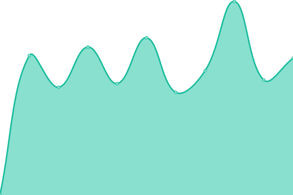
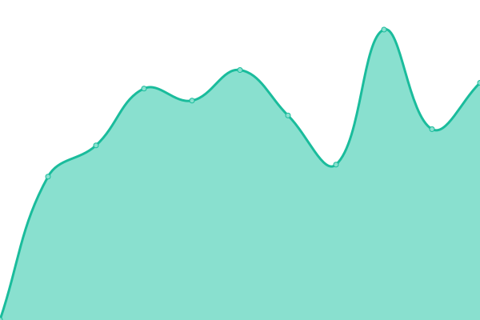

# [📈 Live Status](https://richardtape.github.io/ubcupptime): <!--live status--> **🟩 All systems operational**

This repository contains the open-source uptime monitor and status page for [Richard Tape](https://richardtape.com/), powered by [Upptime](https://github.com/upptime/upptime).

With [Upptime](https://upptime.js.org), you can get your own unlimited and free uptime monitor and status page, powered entirely by a GitHub repository. We use [Issues](https://github.com/richardtape/ubcupptime/issues) as incident reports, [Actions](https://github.com/richardtape/ubcupptime/actions) as uptime monitors, and [Pages](https://richardtape.github.io/ubcupptime) for the status page.

<!--start: status pages-->
<!-- This summary is generated by Upptime (https://github.com/upptime/upptime) -->
<!-- Do not edit this manually, your changes will be overwritten -->

| URL                                          | Status | History                                                                                                 | Response Time                                                                       | Uptime                                                                                                                                                                                                                                   |
| -------------------------------------------- | ------ | ------------------------------------------------------------------------------------------------------- | ----------------------------------------------------------------------------------- | ---------------------------------------------------------------------------------------------------------------------------------------------------------------------------------------------------------------------------------------- |
| [CMS](https://cms.ubc.ca)                    | 🟩 Up  | [cms.yml](https://github.com/richardtape/ubcupptime/commits/master/history/cms.yml)                     |  602ms            |                      |
| [Blogs](https://blogs.ubc.ca)                | 🟩 Up  | [blogs.yml](https://github.com/richardtape/ubcupptime/commits/master/history/blogs.yml)                 |  660ms          |                  |
| [CTLT Events](https://events.ctlt.ubc.ca)    | 🟩 Up  | [ctlt-events.yml](https://github.com/richardtape/ubcupptime/commits/master/history/ctlt-events.yml)     |  1300ms   |      |
| [CourseSpaces](https://coursespaces.ubc.ca/) | 🟩 Up  | [course-spaces.yml](https://github.com/richardtape/ubcupptime/commits/master/history/course-spaces.yml) |  1412ms |  |

<!--end: status pages-->

[**Visit our status website →**](https://richardtape.github.io/ubcupptime)

## 📄 License

- Code: [MIT](./LICENSE) © [Richard Tape](https://richardtape.com/)
- Data in the `./history` directory: [Open Database License](https://opendatacommons.org/licenses/odbl/1-0/)
