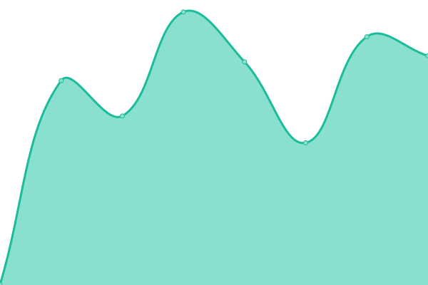
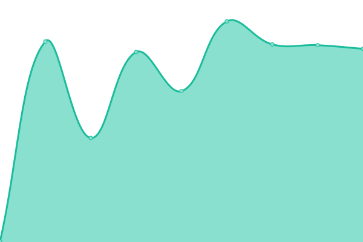

# [📈 Live Status](https://richardtape.github.io/ubcupptime): <!--live status--> **🟧 Partial outage**

This repository contains the open-source uptime monitor and status page for [Richard Tape](https://richardtape.com/), powered by [Upptime](https://github.com/upptime/upptime).

With [Upptime](https://upptime.js.org), you can get your own unlimited and free uptime monitor and status page, powered entirely by a GitHub repository. We use [Issues](https://github.com/richardtape/ubcupptime/issues) as incident reports, [Actions](https://github.com/richardtape/ubcupptime/actions) as uptime monitors, and [Pages](https://richardtape.github.io/ubcupptime) for the status page.

<!--start: status pages-->
<!-- This summary is generated by Upptime (https://github.com/upptime/upptime) -->
<!-- Do not edit this manually, your changes will be overwritten -->
<!-- prettier-ignore -->
| URL | Status | History | Response Time | Uptime |
| --- | ------ | ------- | ------------- | ------ |
|  [CMS](https://cms.ubc.ca) | 🟩 Up | [cms.yml](https://github.com/richardtape/ubcupptime/commits/HEAD/history/cms.yml) | 

 1606ms
     
 | 

<a href="https://richardtape.github.io/ubcupptime/history/cms">99.86%</a>
    

|  [Blogs](https://blogs.ubc.ca) | 🟩 Up | [blogs.yml](https://github.com/richardtape/ubcupptime/commits/HEAD/history/blogs.yml) | 

 481ms
     
 | 

<a href="https://richardtape.github.io/ubcupptime/history/blogs">99.86%</a>
    

|  [CTLT Events](https://events.ctlt.ubc.ca) | 🟩 Up | [ctlt-events.yml](https://github.com/richardtape/ubcupptime/commits/HEAD/history/ctlt-events.yml) | 

 624ms
     
 | 

<a href="https://richardtape.github.io/ubcupptime/history/ctlt-events">100.00%</a>
    

|  [CourseSpaces](https://coursespaces.ubc.ca/) | 🟥 Down | [course-spaces.yml](https://github.com/richardtape/ubcupptime/commits/HEAD/history/course-spaces.yml) | 

 0ms
     
 | 

<a href="https://richardtape.github.io/ubcupptime/history/course-spaces">0.00%</a>
    

<!--end: status pages-->

[**Visit our status website →**](https://richardtape.github.io/ubcupptime)

## 📄 License

- Code: [MIT](./LICENSE) © [Richard Tape](https://richardtape.com/)
- Data in the `./history` directory: [Open Database License](https://opendatacommons.org/licenses/odbl/1-0/)
